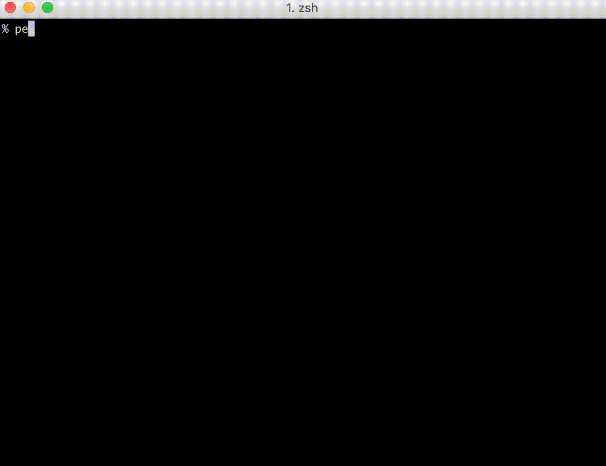
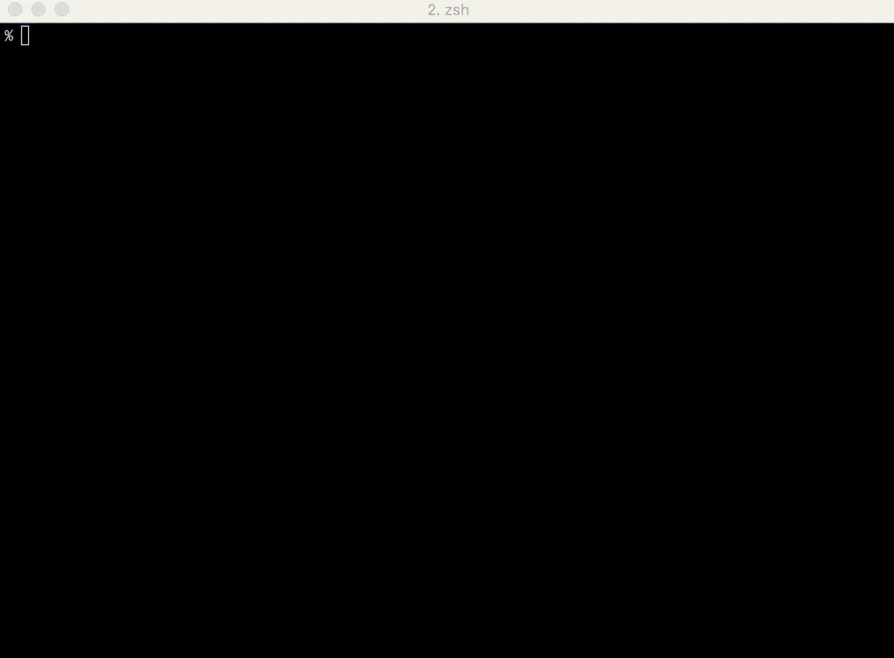
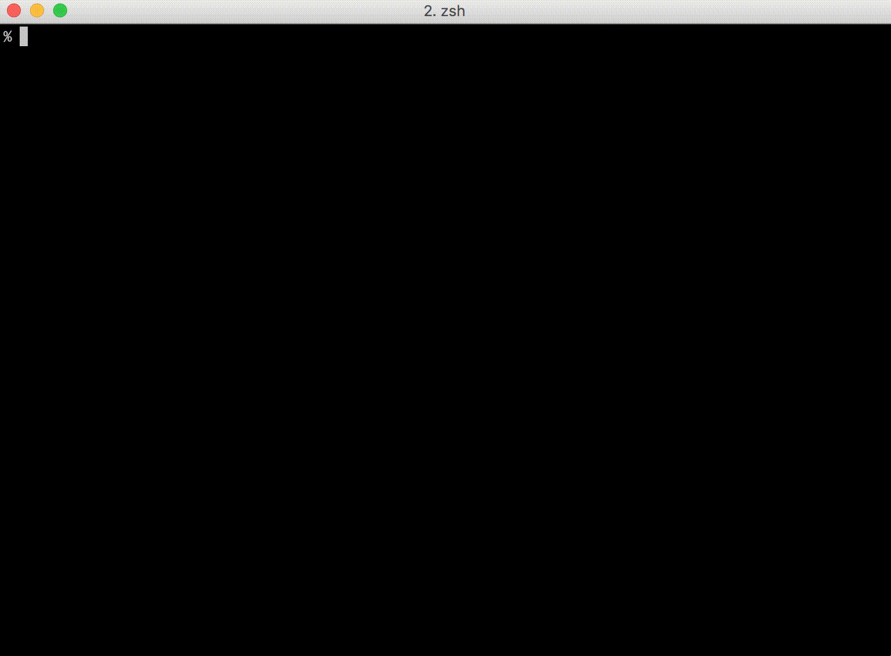

# pet : CLI Snippet Manager

[](https://github.com/knqyf263/pet/releases/latest)
[](https://github.com/knqyf263/pet/blob/master/LICENSE)


Simple command-line snippet manager, written in Go



You can use variables (`<param>` or `<param=default_value>` ) in snippets.


# Abstract

`pet` is written in Go, and therefore you can just grab the binary releases and drop it in your $PATH.

`pet` is a simple command-line snippet manager (inspired by [memo](https://github.com/mattn/memo)).
I always forget commands that I rarely use. Moreover, it is difficult to search them from shell history. There are many similar commands, but they are all different.

e.g. 
- `$ awk -F, 'NR <=2 {print $0}; NR >= 5 && NR <= 10 {print $0}' company.csv` (What I am looking for)
- `$ awk -F, '$0 !~ "DNS|Protocol" {print $0}' packet.csv`
- `$ awk -F, '{print $0} {if((NR-1) % 5 == 0) {print "----------"}}' test.csv`

In the above case, I search by `awk` from shell history, but many commands hit.

Even if I register an alias, I forget the name of alias (because I rarely use that command).

So I made it possible to register snippets with description and search them easily.

# TOC

- [Main features](#main-features)
- [Examples](#examples)
    - [Register the previous command easily](#register-the-previous-command-easily)
        - [bash](#bash-prev-function)
        - [zsh](#zsh-prev-function)
        - [fish](#fish)
    - [Select snippets at the current line (like C-r)](#select-snippets-at-the-current-line-like-c-r)
        - [bash](#bash)
        - [zsh](#zsh)
        - [fish](#fish-1)
    - [Copy snippets to clipboard](#copy-snippets-to-clipboard)
- [Features](#features)
    - [Edit snippets](#edit-snippets)
    - [Sync snippets](#sync-snippets)
- [Usage](#usage)
- [Snippet](#snippet)
- [Configuration](#configuration)
    - [Selector option](#selector-option)
    - [Tag](#tag)
    - [Sync](#sync)
    - [Auto Sync](#auto-sync)
- [Installation](#installation)
    - [Binary](#binary)
    - [Mac OS X / Homebrew](#mac-os-x--homebrew)
    - [RedHat, CentOS](#redhat-centos)
    - [Debian, Ubuntu](#debian-ubuntu)
    - [Archlinux](#archlinux)
    - [Build](#build)
- [Migration](#migration)
- [Contribute](#contribute)

# Main features
`pet` has the following features.

- Register your command snippets easily.
- Use variables in snippets.
- Search snippets interactively.
- Run snippets directly.
- Edit snippets easily (config is just a TOML file).
- Sync snippets via Gist or GitLab Snippets automatically.

# Examples
Some examples are shown below.

## Register the previous command easily
By adding the following config to `.bashrc` or `.zshrc`, you can easily register the previous command.

### bash prev function

```
function prev() {
  PREV=$(echo `history | tail -n2 | head -n1` | sed 's/[0-9]* //')
  sh -c "pet new `printf %q "$PREV"`"
}
```

### zsh prev function

```
$ cat .zshrc
function prev() {
  PREV=$(fc -lrn | head -n 1)
  sh -c "pet new `printf %q "$PREV"`"
}
```

### fish
See below for details.  
https://github.com/otms61/fish-pet



## Select snippets at the current line (like C-r)

### bash
By adding the following config to `.bashrc`, you can search snippets and output on the shell.

```
$ cat .bashrc
function pet-select() {
  BUFFER=$(pet search --query "$READLINE_LINE")
  READLINE_LINE=$BUFFER
  READLINE_POINT=${#BUFFER}
}
bind -x '"\C-x\C-r": pet-select'
```

### zsh

```
$ cat .zshrc
function pet-select() {
  BUFFER=$(pet search --query "$LBUFFER")
  CURSOR=$#BUFFER
  zle redisplay
}
zle -N pet-select
stty -ixon
bindkey '^s' pet-select
```

### fish
See below for details.  
https://github.com/otms61/fish-pet


## Copy snippets to clipboard
By using `pbcopy` on OS X, you can copy snippets to clipboard.


# Features

## Edit snippets
The snippets are managed in the TOML file, so it's easy to edit.


## Sync snippets
You can share snippets via Gist.




# Usage

```
pet - Simple command-line snippet manager.

Usage:
  pet [command]

Available Commands:
  configure   Edit config file
  edit        Edit snippet file
  exec        Run the selected commands
  help        Help about any command
  list        Show all snippets
  new         Create a new snippet
  search      Search snippets
  sync        Sync snippets
  version     Print the version number

Flags:
      --config string   config file (default is $HOME/.config/pet/config.toml)
      --debug           debug mode

Use "pet [command] --help" for more information about a command.
```

# Snippet
Run `pet edit`  
You can also register the output of command (but cannot search).

```
[[snippets]]
  command = "echo | openssl s_client -connect example.com:443 2>/dev/null |openssl x509 -dates -noout"
  description = "Show expiration date of SSL certificate"
  output = """
notBefore=Nov  3 00:00:00 2015 GMT
notAfter=Nov 28 12:00:00 2018 GMT"""
```

Run `pet list`

```
    Command: echo | openssl s_client -connect example.com:443 2>/dev/null |openssl x509 -dates -noout
Description: Show expiration date of SSL certificate
     Output: notBefore=Nov  3 00:00:00 2015 GMT
             notAfter=Nov 28 12:00:00 2018 GMT
------------------------------
```


# Configuration

Run `pet configure`

```
[General]
  snippetfile = "path/to/snippet" # specify snippet directory
  editor = "vim"                  # your favorite text editor
  column = 40                     # column size for list command
  selectcmd = "fzf"               # selector command for edit command (fzf or peco)
  backend = "gist"                # specify backend service to sync snippets (gist or gitlab, default: gist)
  sortby  = "description"         # specify how snippets get sorted (recency (default), -recency, description, -description, command, -command, output, -output)

[Gist]
  file_name = "pet-snippet.toml"  # specify gist file name
  access_token = ""               # your access token
  gist_id = ""                    # Gist ID
  public = false                  # public or priate
  auto_sync = false               # sync automatically when editing snippets

[GitLab]
  file_name = "pet-snippet.toml"  # specify GitLab Snippets file name
  access_token = "XXXXXXXXXXXXX"  # your access token
  id = ""                         # GitLab Snippets ID
  visibility = "private"          # public or internal or private
  auto_sync = false               # sync automatically when editing snippets

```

## Selector option
Example1: Change layout (bottom up)

```
$ pet configure
[General]
...
  selectcmd = "fzf"
...
```

Example2: Enable colorized output
```
$ pet configure
[General]
...
  selectcmd = "fzf --ansi"
...
$ pet search --color
```

## Tag
You can use tags (delimiter: space).
```
$ pet new -t
Command> ping 8.8.8.8
Description> ping
Tag> network google
```

Or edit manually.
```
$ pet edit
[[snippets]]
  description = "ping"
  command = "ping 8.8.8.8"
  tag = ["network", "google"]
  output = ""
```

They are displayed with snippets.
```
$ pet search
[ping]: ping 8.8.8.8 #network #google
```

## Sync
### Gist
You must obtain access token.
Go https://github.com/settings/tokens/new and create access token (only need "gist" scope).
Set that to `access_token` in `[Gist]` or use an environment variable with the name `$PET_GITHUB_ACCESS_TOKEN`.

After setting, you can upload snippets to Gist.  
If `gist_id` is not set, new gist will be created.
```
$ pet sync
Gist ID: 1cedddf4e06d1170bf0c5612fb31a758
Upload success
```

Set `Gist ID` to `gist_id` in `[Gist]`.
`pet sync` compares the local file and gist with the update date and automatically download or upload.

If the local file is older than gist, `pet sync` download snippets.
```
$ pet sync
Download success
```

If gist is older than the local file, `pet sync` upload snippets.
```
$ pet sync
Upload success
```

*Note: `-u` option is deprecated*

### GitLab Snippets
You must obtain access token.
Go https://gitlab.com/profile/personal_access_tokens and create access token.
Set that to `access_token` in `[GitLab]` or use an environment variable with the name `$PET_GITLAB_ACCESS_TOKEN`..

After setting, you can upload snippets to GitLab Snippets.
If `id` is not set, new snippet will be created.
```
$ pet sync
GitLab Snippet ID: 12345678
Upload success
```

Set `GitLab Snippet ID` to `id` in `[GitLab]`.
`pet sync` compares the local file and gitlab with the update date and automatically download or upload.

If the local file is older than gitlab, `pet sync` download snippets.
```
$ pet sync
Download success
```

If gitlab is older than the local file, `pet sync` upload snippets.
```
$ pet sync
Upload success
```

## Auto Sync
You can sync snippets automatically.
Set `true` to `auto_sync` in `[Gist]` or `[GitLab]`.
Then, your snippets sync automatically when `pet new` or `pet edit`.

```
$ pet edit
Getting Gist...
Updating Gist...
Upload success
```

# Installation
You need to install selector command ([fzf](https://github.com/junegunn/fzf) or [peco](https://github.com/peco/peco)).  
`homebrew` install `fzf` automatically.

## Binary
Go to [the releases page](https://github.com/knqyf263/pet/releases), find the version you want, and download the zip file. Unpack the zip file, and put the binary to somewhere you want (on UNIX-y systems, /usr/local/bin or the like). Make sure it has execution bits turned on. 

## Mac OS X / Homebrew
You can use homebrew on OS X.
```
$ brew install knqyf263/pet/pet
```

If you receive an error (`Error: knqyf263/pet/pet 64 already installed`) during `brew upgrade`, try the following command

```
$ brew unlink pet && brew uninstall pet
($ rm -rf /usr/local/Cellar/pet/64)
$ brew install knqyf263/pet/pet
```

## RedHat, CentOS
Download rpm package from [the releases page](https://github.com/knqyf263/pet/releases)
```
$ sudo rpm -ivh https://github.com/knqyf263/pet/releases/download/v0.3.0/pet_0.3.0_linux_amd64.rpm
```

## Debian, Ubuntu
Download deb package from [the releases page](https://github.com/knqyf263/pet/releases)
```
$ wget https://github.com/knqyf263/pet/releases/download/v0.3.0/pet_0.3.0_linux_amd64.deb
dpkg -i pet_0.3.0_linux_amd64.deb
```

## Archlinux
Two packages are available in [AUR](https://wiki.archlinux.org/index.php/Arch_User_Repository).
You can install the package [from source](https://aur.archlinux.org/packages/pet-git):
```
$ yaourt -S pet-git
```
Or [from the binary](https://aur.archlinux.org/packages/pet-bin):
```
$ yaourt -S pet-bin
```

## Build

```
$ mkdir -p $GOPATH/src/github.com/knqyf263
$ cd $GOPATH/src/github.com/knqyf263
$ git clone https://github.com/knqyf263/pet.git
$ cd pet
$ make install
```

# Migration
## From Keep
https://blog.saltedbrain.org/2018/12/converting-keep-to-pet-snippets.html

# Contribute

1. fork a repository: github.com/knqyf263/pet to github.com/you/repo
2. get original code: `go get github.com/knqyf263/pet`
3. work on original code
4. add remote to your repo: git remote add myfork https://github.com/you/repo.git
5. push your changes: git push myfork
6. create a new Pull Request

- see [GitHub and Go: forking, pull requests, and go-getting](http://blog.campoy.cat/2014/03/github-and-go-forking-pull-requests-and.html)

----

# License
MIT

# Author
Teppei Fukuda
